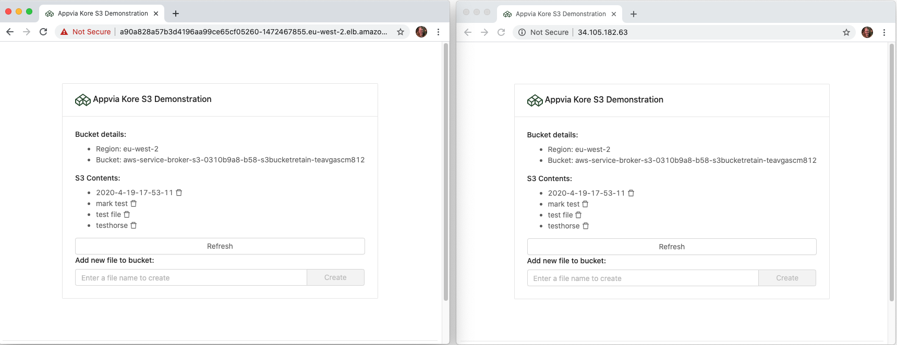

This is just to demonstrate being able to access S3 from a container running in a kore-provisioned cluster.



To use (adjusting the author/image/version as you wish):

```
docker build -t mrsheepuk:s3-test-app:v0.0.1 .
docker push mrsheepuk/s3-test-app:v0.0.1
```

Then update deployment-gke.yml / deployment-eks.yml with the image/tag/version and deploy to a Kore cluster. 

The below steps assume you have created a kore team app-team-1 with clusters `app-team-1-gke-dev`
and `app-team-1-eks-dev`, each with a namespace (`gke-devtest` and `eks-devtest` respectively), and a single S3 'Services'
resource which is bound into the namespace on each cluster with the names `gke-s3` and `eks-s3` respectively.

Spin it up on both clusters and watch them both interact with the single S3 bucket. Kinda cool!

### GKE example: 

```
kore login
kore kubeconfig -t app-team-1

kubectl config use-context app-team-1-gke-dev
kubectl config set-context --current --namespace=gke-devtest

kubectl get pods
kubectl apply -f deployment-gke.yml
kubectl expose deployment s3-test-app --type LoadBalancer --port 80 --target-port 3001 
kubectl get service s3-test-app
```

### EKS example:

```
kore login
kore kubeconfig -t app-team-1

kubectl config use-context app-team-1-eks-dev
kubectl config set-context --current --namespace=eks-devtest

kubectl get pods
kubectl apply -f deployment-eks.yml
kubectl expose deployment s3-test-app --type LoadBalancer --port 80 --target-port 3001 
kubectl get service s3-test-app
```

Don't forget to delete everything afterwards.

```
kubectl config use-context app-team-1-gke-dev
kubectl config set-context --current --namespace=gke-devtest
kubectl delete service s3-test-app

kubectl config use-context app-team-1-eks-dev
kubectl config set-context --current --namespace=eks-devtest
kubectl delete service s3-test-app
```